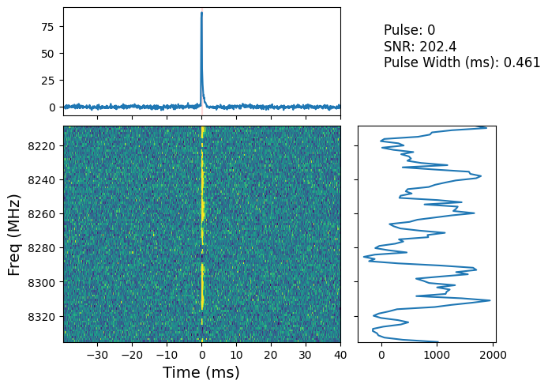

# FRB Processing

## Introduction

Fast Radio Bursts (FRBs) are brief, bright pulses of radio emission from distant galaxies. They're one of the universe's most perplexing mysteries, offering intriguing opportunities for investigating the intergalactic medium and cosmology. This project is designed to process raw data (in *.vrad files) associated with these FRBs, execute multiple preprocessing steps, generate detailed plots of bursts and their characteristics, and conduct burst analysis.
## Objective

The primary goal of this project is to convert raw FRB data into a more interpretable and usable formatting, allowing it for detailed analysis and visualization of FRBs.

## Methodology

The project pipeline consists of four main stages:

1. **Vrad to CS**: The project inputs are scan_table (containing start time of observation) and a singlepulse file (containing all the pulses and the offsets from the start observation). Each pulse in the singlepulse file is processed to calculate the observation time and converted into *.cs file format (after passing through an intermediate *.vdr format). The pipeline also manages differences in x-band and s-band files, grouping and assigning frequencies as required.

2. **CS to Filterbank**: The *.cs files are converted into filterbank files, which are more suitable for analysis. For x-band files, aggregation occurs at this stage. The number of channels can be set here, defining the time series for the data.

3. **Plot**: This stage uses the filterbank files to generate detailed plots of the FRBs. The plots present a dynamic spectrum, time-series, and spectrum for each pulse. The pipeline can handle switching between s and x bands and applies time-channel averaging to improve pulse visibility.

4. **Scintilation Bandwidth**: This stage finds the scintilation bandwidth of every pulse. It also plots the spectrum plot and the ACF of the spectrum only around the exact time frame of the pulse. 

5. **Dispersion Measure Optimization**: This stage optimizes the dispersion measure (DM) of the FRBs. By iterating through a range of possible DM values, the optimal DM is identified as the one that maximizes the Signal-to-Noise Ratio (SNR).

## Setup and Usage

### Structural Setup

1. This project has a modular structure with a master script (frb_process) and several subscripts, each housed in their own subdirectory of the same name. In of the stages described above has a separate script located in its corresponding subdirectory. plotfil and dmopt also have two more dependent files called sp_spec.py
```bash
.
├── frb_process.py
├── vrad2cs/
│   └── vrad2cs.py
├── cs2fil/
│   └── cs2fil.py
├── plotfil/
│   └── plotfil.py
│   └── sp_spec.py
├── dmopt/
│   └── dmopt.py
|   └── sp_spec.py
└── plot_scint/
    └── plot_scint.py
 ```
 
 2. Indirectory: Put following infiles in any indirectory
    - \*vrad files: These are stored in a subfolder in the indirectory preferebaly with the name (/vrad). These are the raw telescope readings. The .vrad files are assumed to be in the format Ex. `22-295-001_d63_PSR2_SLCP.vrad` The key here is making sure there is a -ddd (three digits) along with SLCP/SRCP/XLCP/XRCP in the file name. 
    - Singlepulse file: This is a .txt file specifying pulse readings from observation. Assumed to be in the format `*.singlepulse`. Ex. `srcp-0001_DM178.850.singlepulse`
    - Scan table/.inf file: This is a info .txt file specifying the telescope reading info. You can put either a file with `scan.table` in its name or in the format `*.inf`. Ex. `scan.table.23m041` or `slcp-0001_DM219.460.inf`

```
indirectory/
├── vrad/
│   ├── 22-295-001_d63_PSR2_SLCP.vrad
│   ├── anotherfile_dxx_PSR2_XRCP.vrad
│   └── ...
├── srcp-0001_DM178.850.singlepulse
└── scan.table.23m041 or slcp-0001_DM219.460.inf
```

3. Outdirectory: Use the following outdirectory structure. The names of the subdirectory are recommended but not required. They can be changed in the configuration file. The subdirectories are named after the files that will be stored in them. 

```
outdirectory/
├── cs/
├── dada/
├── dm/
├── fil/
├── npy/
├── png/
└── vdr/
```

### Setting Configuration
Configure the following settings in `frb_process_config` (Example configuration is given already for 22-295). :
```
- inf file (inf_file): (basename only)
- single pulse file (sp_file): (basename only)
- vrad directory (vrad_dir): (make sure it's located in out directory, basename only, preferably named vrad/)
- vrad basename (vrad_base): (set to first 5 digits of telescope reading of filename. ex. 22-295)
- frequency band (freq_band): (either "x" or "s" LOWERCASE)
- basename (cs_base, fil_base, npy_base): (MATCH with "x" or "s" if you want to run on same files) depending what you put above
- number channels (nchans): This is a LIST. You can specify multiple channels/time resolutions
- offset file (offset_file): This will contain calculated pulse offset times. It will be put in the outdirectory. Name whatever you want
- Time average (tavg): How much to average across time series
- Time duration (tdur): How much of pulse to plot
- DM info (dm, dm_lo, dm_hi, dm_step): DM and DM optimization parameters. 
- cleanup (cleanup): this flag will remove vrad and dada intermediate files 
- flags (vrad_to_cs, cs_to_fil, plot_fil, plot_scint, dm_opt). True or False depending on what stages of the pipeline to run
```
### Usage
Before running, ensure you are in the `Singularity` environment. Run `python3 frb_process.py`.
## Results
 Pulse time-series (top), dynamic spectrum (middle), spectrum (right) plot of brightest pulse of J1810-197 magnetar

